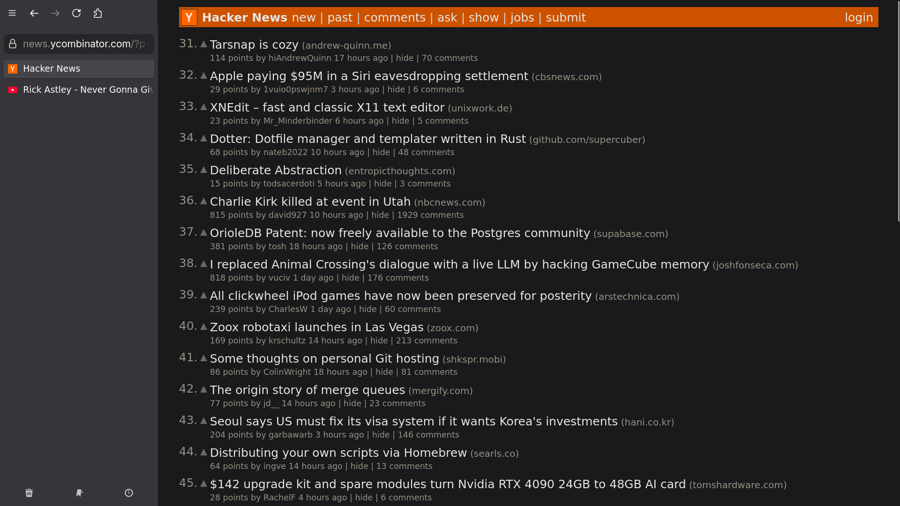
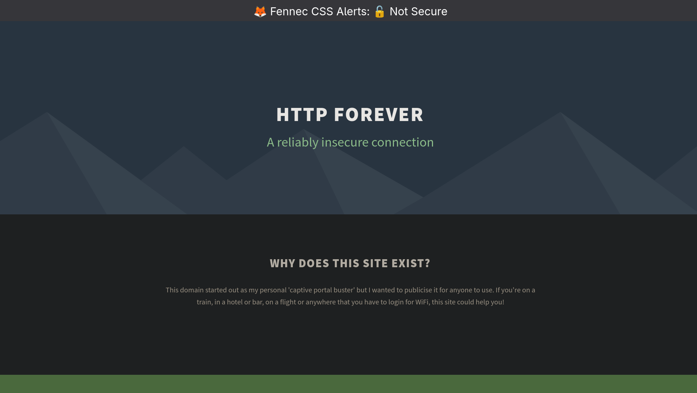

# 🦊 Fennec CSS

*Clean browsing with integrated Sideberry sidebar - no visual clutter, just pure functionality.*

A clean, minimal Firefox CSS theme designed for **first-class Sideberry support** without the typical Firefox UI baggage. Inspired by the elegant UX philosophy of Zen Browser.

## Objective

Transform Firefox into a distraction-free browsing experience that prioritizes:

- **Seamless Sideberry Integration** - Toggle entire Fennec UI with Sideberry's built-in hotkey
- **Minimal Chrome** - Remove unnecessary Firefox UI elements that clutter the experience  
- **Zen-Inspired Design** - Clean, purposeful aesthetics focused on content
- **Distraction-Free Browsing** - Let your content and workflow take center stage

**Security Features**: Even when the UI is completely hidden, Fennec CSS will attempt to display prominent security warnings for insecure sites (HTTP or broken HTTPS), to support awareness of browsing unsafely at all times.

## What This Theme Provides

- Streamlined tab bar integration with Sideberry
- Reduced visual noise from Firefox's default interface
- Optimized spacing for comfortable reading and navigation

## Dependencies

### Required Extensions
- **[Sideberry](https://addons.mozilla.org/en-US/firefox/addon/sidebery/)** - Essential for sidebar tab management and the core functionality of this theme. Sideberry's toggle hotkey controls the entire Fennec UI experience.

### Recommended Extensions
- **[Vimium](https://addons.mozilla.org/en-US/firefox/addon/vimium-ff/)** - Keyboard-driven navigation that complements the minimal, distraction-free interface

These extensions work together to create a cohesive, keyboard-friendly browsing experience that maximizes screen real estate and minimizes visual distractions. When you toggle Sideberry off, both the sidebar and navigation bar disappear for true distraction-free browsing.

Reactivating the sidebar can be retoggling sideberry, or other sidebar controls
like history which defaults to ctrl+h

## Installation

1. Enable `toolkit.legacyUserProfileCustomizations.stylesheets` in `about:config`
2. Navigate to your Firefox profile folder
3. Create a `chrome` folder if it doesn't exist
4. Copy `userChrome.css` to the `chrome` folder
5. Install [Sideberry extension](https://addons.mozilla.org/en-US/firefox/addon/sidebery/)
6. Use sideberry.css in the sideberry custom css settings
7. Configure Sideberry's toggle hotkey in "Manage Extension Shortcuts" (F1 by default)
8. Restart Firefox

## Philosophy

This theme embraces the principle that **the best interface is the one you don't notice**. By removing Firefox's visual baggage and creating seamless integration with Sideberry, we achieve a browsing experience that feels purposeful and distraction-free - much like what Zen Browser aims to provide, but with the flexibility and extensibility of Firefox.

## How It Works

When you press Sideberry's toggle hotkey:
- **Sidebar visible**: Normal Fennec UI with navigation bar and URL bar positioned above Sideberry
- **Sidebar hidden**: Entire navigation interface disappears for distraction-free browsing

This elegant toggle gives you the best of both worlds - organized tab management when you need it, a clean browsing experience when you don't, and security awareness at all times.

Perfect for users who want the stability of Firefox with the clean aesthetics of modern, minimal browsers.

## Disclaimer

**This is a CSS theme for educational and aesthetic purposes only.** 

- This theme modifies Firefox's user interface, including security indicators
- While we've made efforts to preserve important security warnings, **no guarantee is provided**
- **Use at your own risk** - The author is not liable for any security issues, data breaches, or other damages
- **You are responsible** for verifying the security of websites you visit
- This is **not a security tool** - it's purely a visual theme
- Always keep Firefox and your extensions updated
- Consider the security implications before using any userChrome modifications

**By using this theme, you acknowledge these risks and agree that the author bears no responsibility for any consequences.**