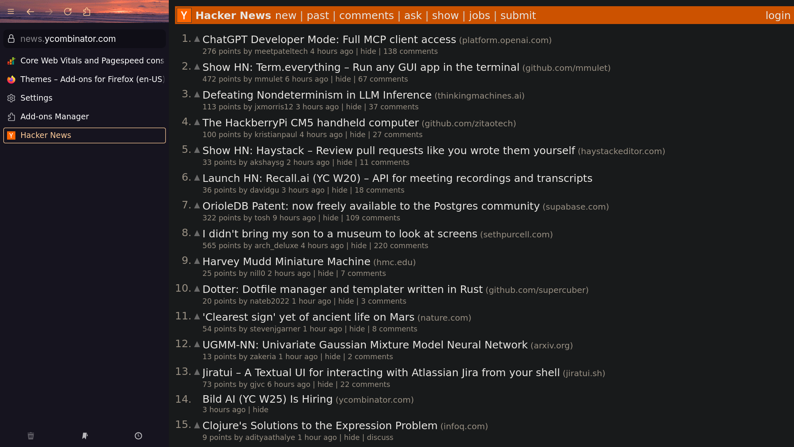

# Fennec UI

A minimal Mozilla Firefox CSS theme designed for **first-class Sideberry support** without the typical UI baggage. Inspired by the elegant UX of Zen Browser.

Perfect for people who want the stability of Firefox with a few quality enhancements.

## Features

🔗 **Complete Sideberry Integration** - Urlbar inside the sidebar-box, aligned url and icons

🧘 **Zen Mode** - Toggling the sidebar hides the UI, maximizing screen space and aiding focus when tiled or fullscreen

✨ **Minimal Chrome** - Remove unnecessary Firefox UI elements that clutter the experience  

🔧 **Easily Extendable** - Clean code and detailed docs to support contribution and customization

🎨 **Theme Support** - Use your favorite Firefox themes, with additional sideberry optimizations

[Animated Sea Sunset 02](https://addons.mozilla.org/en-US/firefox/addon/animated-sea-sunset-02/) - A beautiful animated theme showcasing Fennec's theme compatibility

## Installation

Note: Please see [disclaimer](#disclaimer) before installing

1. In Firefox settings, ensure "Horizontal Tabs" is on, "Sidebar off", and the sidebar is configure to be on the left side of the browser
2. Enable `toolkit.legacyUserProfileCustomizations.stylesheets` in `about:config`
3. Navigate to your Firefox profile folder
   - Open Firefox
   - Type `about:support` in the address bar and press enter
   - Look for the Application Basics section.
   - Click on Open Profile Folder. This will open the folder which contains your user data.
   - On the Flatpak version of Firefox the directory is `~/.var/app/org.mozilla.firefox/.mozilla/firefox/<profile>`
4. Now create a `chrome` folder in your profile folder if it doesn't exist
5. Copy `userChrome.css` to the `chrome` folder, from this repo's chrome folder
6. Install [Sideberry extension](https://addons.mozilla.org/en-US/firefox/addon/sidebery/)
7. Use sideberry.css in the sideberry custom css settings
8. Restart Firefox

### Optional Recommended Extensions
- **[Vimium](https://addons.mozilla.org/en-US/firefox/addon/vimium-ff/)** - Keyboard-driven navigation that complements the minimal, distraction-free interface

## Usage Guide

Utilizing the chosen hotkey for user chrome toggle hides the whole UI

This elegant toggle gives you the best of both worlds - organized tab management when you need it, a clean browsing experience when you don't

📋 **[Roadmap & Release Notes](https://github.com/tompassarelli/fennec-css/wiki)** - project wiki for roadmap and release notes as inclined.

👾 **[Known Issues & Troubleshooting](https://github.com/tompassarelli/fennec-ui/wiki/Troubleshooting)** - noted some common issues and workarounds 

## Disclaimer

- The install guide directs users to download Firefox extensions, which can introdue security vulnerabilities or take direct hostile actions against users. 
- Zen Mode hides the UI which obviously suppresses security signals like padlock warnings. In appreciation of this concern, Fennec will still attempt to surface some security warnings (ex. HTTP Not Secure) prepended to page content as a header alert. Not a solution against phishing and other attacks, only toggle the UI after the page has been verified as secure and trustworthy.
- **Use at your own risk** - The author is not liable for any security issues, data breaches, or other damages of usage of this repository or mentioned extensions.
- **You are responsible** for verifying the security of websites, code, and extensions used
- Always keep Firefox updated

**By using this theme and mentioned Firefox extensions, you acknowledge these risks and agree that the author bears no responsibility for any consequences.**