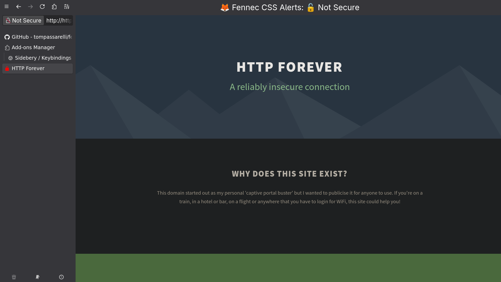

# 🦊 Fennec UI

*Clean browsing with integrated Sideberry sidebar - no visual clutter, just pure functionality.*

A clean, minimal Firefox CSS theme designed for **first-class Sideberry support** without the typical Firefox UI baggage. Inspired by the elegant UX philosophy of Zen Browser.

📋 **[Roadmap & Releases](https://github.com/tompassarelli/fennec-css/wiki)** - project wiki for roadmap and release notes as inclined.

## Objective

Transform Firefox into a distraction-free browsing experience that prioritizes:

- **Seamless Sideberry Integration** - Toggle entire Fennec UI with Sideberry's built-in hotkey
- **Minimal Chrome** - Remove unnecessary Firefox UI elements that clutter the experience  
- **Zen-Inspired Design** - Clean, purposeful aesthetics focused on content
- **Distraction-Free Browsing** - Let your content and workflow take center stage

**Security Features**: Even when the UI is completely hidden, Fennec UI will attempt to display prominent security warnings for insecure sites (HTTP or broken HTTPS)

When the UI is not hidden we still show this warning, you can easily disable
this if you wish in the userChrome.css. There may be a companion extension
in the future in which sites can be whitelisted. 

## Dependencies

### Required Extensions
- **[Sideberry](https://addons.mozilla.org/en-US/firefox/addon/sidebery/)** - Essential for sidebar tab management and the core functionality of this theme. Sideberry's toggle hotkey controls the entire Fennec UI experience.
- **[UserChrome Toggle Extended](https://addons.mozilla.org/en-US/firefox/addon/userchrome-toggle-extended/)** - Enables dynamic CSS toggling for seamless sidebar hiding (ctrl+shift+1 default, zen would be ctrl+alt+c)

### Recommended Extensions
- **[Vimium](https://addons.mozilla.org/en-US/firefox/addon/vimium-ff/)** - Keyboard-driven navigation that complements the minimal, distraction-free interface

These extensions work together to create a cohesive, keyboard-friendly browsing experience that maximizes screen real estate and minimizes visual distractions. When you toggle Sideberry off, both the sidebar and navigation bar disappear for true distraction-free browsing.

Reactivating the sidebar can be retoggling sideberry, or other sidebar controls
like history which defaults to ctrl+h

## Installation

1. Enable `toolkit.legacyUserProfileCustomizations.stylesheets` in `about:config`
2. Navigate to your Firefox profile folder see - https://docs.zen-browser.app/guides/live-editing on the profile section 
3. Create a `chrome` folder if it doesn't exist
4. Copy `userChrome.css` to the `chrome` folder
5. Install [Sideberry extension](https://addons.mozilla.org/en-US/firefox/addon/sidebery/)
6. Use sideberry.css in the sideberry custom css settings
7. Install [Userchrome Toggle Extended](https://addons.mozilla.org/en-US/firefox/addon/userchrome-toggle-extended/)
8. Change 'style 1' (hide all ui) to preferred hotkey desired in "manage extension shortcuts"
9. Restart Firefox

## How It Works

Utilizing the chosen hotkey for user chrome toggle hides the whole UI

This elegant toggle gives you the best of both worlds - organized tab management when you need it, a clean browsing experience when you don't, and security awareness at all times.

Perfect for users who want the stability of Firefox with the clean aesthetics of modern, minimal browsers.

## Known Issues & Troubleshooting

### Notifications Hidden When UI Toggled
**Issue**: Permission notifications (location, microphone, camera) may be hidden when the UI is toggled off.

**Context**: This affects situations where websites request permissions while in distraction-free mode.

**Workaround**: Toggle the UI back on and retry the action to see missed notifications.

### UserChrome Toggle Extended Not Responding
**Issue**: The extension hotkey may not trigger UI toggling.

**Workaround**: Click/hotkey the address bar then retry. 

### I see only the URL bar but the sidebar is hidden, can't seem to reset it correctly.
**Issue**: You deactivated the sidebar by toggling a sidebar panel, which by default
in firefox is not joined with the URL bar component, so fennec cannot stop this until
there is more robust native support (exploring, some progress, may or may not happen)

**Workaround**: try toggling the sidebar with any sidebar panel (sideberry, history, etc) and then try the userchrome toggle hotkey to resync state.

## Disclaimer

**This is a CSS theme for educational and aesthetic purposes only.** 

- This theme modifies Firefox's user interface, which can interfere with security indicators (notably, when the UI is completely hidden)
- Efforts have been made to preserve important security warnings even when the UI is hidden, **no guarantee is provided**
- **Use at your own risk** - The author is not liable for any security issues, data breaches, or other damages
- **You are responsible** for verifying the security of websites you visit
- This is **not a security tool** - it's purely a visual theme
- Always keep Firefox and your extensions updated
- Consider the security implications before using any userChrome modifications

**By using this theme, you acknowledge these risks and agree that the author bears no responsibility for any consequences.**