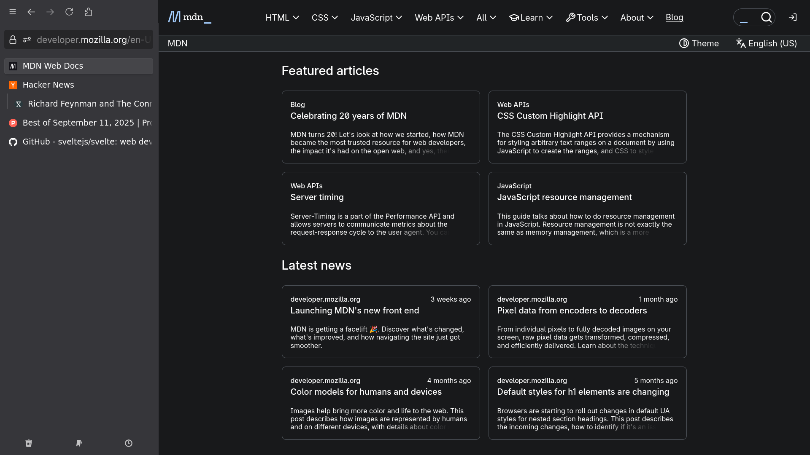

## Preview

*Clean browsing with integrated Sideberry sidebar - no visual clutter, just pure functionality.*

A clean, minimal Firefox CSS theme designed for **first-class Sideberry support** without the typical Firefox UI baggage. Inspired by the elegant UX philosophy of Zen Browser.

## Objective

Transform Firefox into a distraction-free browsing experience that prioritizes:

- **Seamless Sideberry Integration** - Hide entire sidebar with ctrl+shift+1 (or whatever hotkey, I use ctrl+alt+c, supported by User Chrome Toggle Extended)
- **Minimal Chrome** - Remove unnecessary Firefox UI elements that clutter the experience  
- **Zen-Inspired Design** - Clean, purposeful aesthetics focused on content
- **Distraction-Free Browsing** - Let your content and workflow take center stage

## What This Theme Provides

- Streamlined tab bar integration with Sideberry
- Reduced visual noise from Firefox's default interface
- Optimized spacing for comfortable reading and navigation

## Dependencies

### Required Extensions
- **[Sideberry](https://addons.mozilla.org/en-US/firefox/addon/sidebery/)** - Essential for sidebar tab management and the core functionality of this theme
- **[UserChrome Toggle Extended](https://github.com/Naezr/userchrome-toggle-extended-2)** - Enables dynamic CSS toggling for seamless sidebar hiding (ctrl+shift+1 or custom hotkey)

### Recommended Extensions
- **[Vimium](https://addons.mozilla.org/en-US/firefox/addon/vimium-ff/)** - Keyboard-driven navigation that complements the minimal, distraction-free interface

These extensions work together to create a cohesive, keyboard-friendly browsing experience that maximizes screen real estate and minimizes visual distractions.

## Installation

1. Enable `toolkit.legacyUserProfileCustomizations.stylesheets` in `about:config`
2. Navigate to your Firefox profile folder
3. Create a `chrome` folder if it doesn't exist
4. Copy `userChrome.css` to the `chrome` folder
5. Install [Sideberry extension](https://addons.mozilla.org/en-US/firefox/addon/sidebery/)
6. Use sideberry.css in the sideberry custom css settings, and in Navigation Section set Layout to hidden
7. Restart Firefox

## Philosophy

This theme embraces the principle that **the best interface is the one you don't notice**. By removing Firefox's visual baggage and creating seamless integration with Sideberry, we achieve a browsing experience that feels purposeful and distraction-free - much like what Zen Browser aims to provide, but with the flexibility and extensibility of Firefox.

Perfect for users who want the power of Firefox with the clean aesthetics of modern, minimal browsers.
